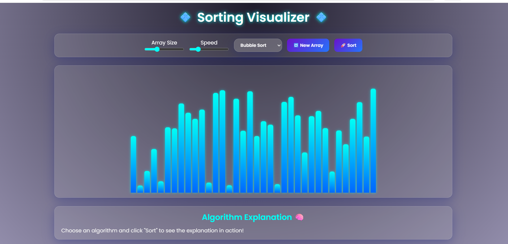

# Sorting Visualizer

An interactive web-based application built using **HTML, CSS, and JavaScript** that visually demonstrates how sorting algorithms work — step by step, in real time, with animated color-coded bars.

The goal was to move beyond reading about sorting algorithms and actually *see* them — watching how Bubble Sort slowly bubbles elements to the right, how Merge Sort splits and conquers, or how Quick Sort pivots and partitions — all live in the browser without any backend or framework.

> **Note:** This is a pure frontend project — no server, no build tools, no dependencies. Just open `index.html` in any browser and it works.

---

## Screenshot


----
## What it does

Users can:
- **Generate a new random array** using the **New Array** button
- **Choose any sorting algorithm** from the dropdown menu (Bubble Sort, Selection Sort, Insertion Sort, Merge Sort, Quick Sort, Heap Sort)
- **Adjust array size and sorting speed** using the dedicated sliders
- **Click Sort** to watch the algorithm animate live — cyan/blue gradient bars update in real time showing comparisons and swaps
- **Read the Algorithm Explanation panel** at the bottom — it dynamically describes what the chosen algorithm is doing as it runs
- Use it on **desktop or mobile** — the UI is fully responsive

---

## Algorithms Implemented

| Algorithm | Type | Time Complexity (Avg) | Space Complexity |
|---|---|---|---|
| Bubble Sort | Comparison | O(n²) | O(1) |
| Selection Sort | Comparison | O(n²) | O(1) |
| Insertion Sort | Comparison | O(n²) | O(1) |
| Merge Sort | Divide & Conquer | O(n log n) | O(n) |
| Quick Sort | Divide & Conquer | O(n log n) | O(log n) |
| Heap Sort | Comparison (Heap) | O(n log n) | O(1) |

Each algorithm is implemented in JavaScript with `async/await` to allow frame-by-frame animation using controlled delays — so you can slow down or speed up the visualization at any point.

---

## Tech Stack

| Layer | Tools |
|---|---|
| Structure | HTML5 |
| Styling | CSS3 (dark gradient theme, glassmorphism cards, smooth transitions, responsive layout) |
| Logic & Animation | JavaScript (ES6+), DOM manipulation, async/await |
| Version control | Git, GitHub |

---

## Key Concepts Demonstrated

**DOM Manipulation**
Each bar is a `div` element whose height represents its value. The JS engine dynamically updates bar heights and colors on every comparison and swap — no canvas, no external library.

**Asynchronous JavaScript**
Every algorithm uses `async/await` with a `sleep()` helper (a `Promise`-wrapped `setTimeout`) to pause between steps. The speed slider directly controls the delay duration, making animation speed fully adjustable mid-sort.

**Algorithm Explanation Panel**
A dynamic explanation section at the bottom updates in real time as the algorithm runs, describing what's happening at each step — making it useful not just as a visualizer but as a learning tool.

**Bar Color States**
Bars change color to communicate algorithm state at every step:
- 🩵 **Cyan/Blue gradient** — default unsorted element
- 🟡 **Yellow** — elements currently being compared
- 🔴 **Red** — elements being swapped
- 🟢 **Green** — element placed in its final sorted position

**Responsive UI Design**
Built with a dark gradient aesthetic — deep purple background, glowing cyan bars, frosted glass control panels — optimized for both desktop and mobile without any CSS framework.

---

## Folder Structure

```
Sorting_Visualizer/
├── index.html        Main HTML — UI layout, controls, algorithm dropdown
├── style.css         Dark gradient theme, glassmorphism, responsive layout
└── script.js         All 6 algorithm implementations + async animation engine
```

---

## How to Run

No installation needed. Just:

```bash
# Clone the repo
git clone https://github.com/sejalbhupal/Sorting_Visualizer.git

# Open in browser
cd Sorting_Visualizer
open index.html       # macOS
# or double-click index.html on Windows / Linux
```

**Steps to use:**
1. Open `index.html` in any modern browser
2. Use the **Array Size** slider to set how many elements to sort
3. Use the **Speed** slider to control animation speed
4. Select an algorithm from the **dropdown menu**
5. Click **New Array** to generate a fresh random array
6. Click **Sort** to start the visualization
7. Watch the **Algorithm Explanation** panel at the bottom for step-by-step context

---

## What I Learned

- How sorting algorithms *actually* behave on data — not just in theory, but visually, step by step
- How to implement **asynchronous animations** in vanilla JavaScript using `async/await` and `Promise`-based delays
- How to build a **fully responsive dark-themed UI** with pure CSS — no Bootstrap, no Tailwind
- The real performance difference between O(n²) and O(n log n) algorithms becomes obvious just by watching them run side by side on the same array

---

## Author

**Sejal Bhupal**
B.E. Computer Engineering, St. Vincent Pallotti College of Engineering & Technology, Nagpur
[GitHub](https://github.com/sejalbhupal) • [LinkedIn](https://linkedin.com/in/sejal-bhupal)
